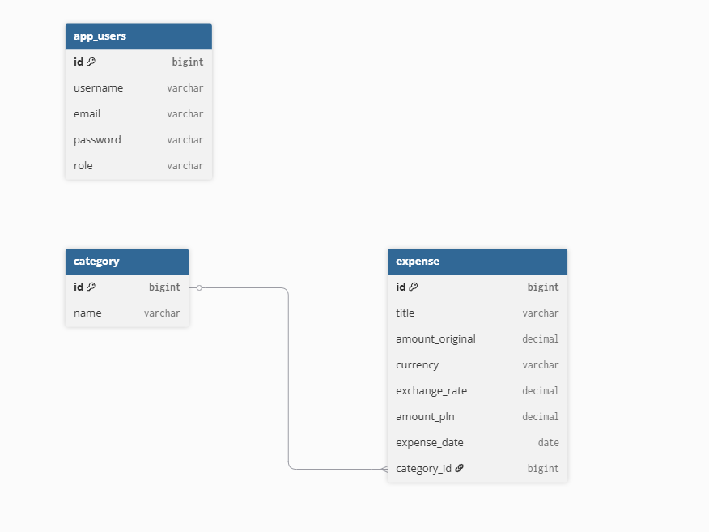
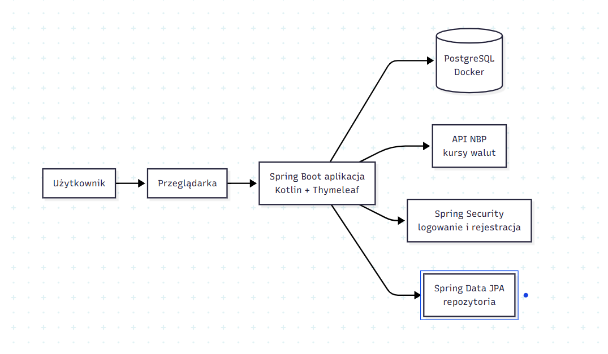

# Budgetly

## Opis projektu

Budgetly to aplikacja webowa służąca do zarządzania wydatkami osobistymi oraz monitorowania budżetu użytkownika.

System umożliwia rejestrowanie wydatków w różnych walutach, przypisywanie ich do kategorii oraz automatyczne przeliczanie wartości na PLN przy wykorzystaniu aktualnych kursów walut pobieranych z API Narodowego Banku Polskiego.


System umożliwia:

- rejestrację użytkowników,
- logowanie użytkowników,
- zarządzanie kategoriami wydatków,
- dodawanie wydatków,
- edycję wydatków,
- usuwanie wydatków,
- przeglądanie raportów miesięcznych,
- automatyczne przeliczanie wydatków na PLN przy wykorzystaniu API NBP.

---

## Funkcjonalności

### Użytkownicy

- rejestracja
- logowanie
- szyfrowanie haseł (Spring Security)

### Kategorie

- dodawanie kategorii
- edycja kategorii
- usuwanie kategorii
- wyświetlanie listy kategorii

### Wydatki

- dodawanie wydatków
- edycja wydatków
- usuwanie wydatków
- filtrowanie po miesiącu
- raport miesięczny

### Integracja z API

- pobieranie kursów walut z API NBP
- automatyczne przeliczanie wydatków na PLN

---

## Stos technologiczny

### Backend

- Kotlin
- Spring Boot
- Spring Security
- Spring Data JPA

### Frontend

- Thymeleaf
- Bootstrap 5

### Baza danych

- PostgreSQL

### Konteneryzacja

- Docker
- Docker Compose

### Narzędzia

- Maven
- Git
- GitHub
- GitHub Actions

---

## Architektura systemu

Wstaw tutaj diagram architektury.



---

## Model danych (ERD)

Wstaw tutaj diagram ERD.



---

## Uruchomienie projektu

### Klonowanie repozytorium

```bash
git clone https://github.com/Patrycja12345678910/budgetly
cd budgetly
```

### Uruchomienie PostgreSQL

```bash
docker compose up -d
```

### Uruchomienie aplikacji

Linux / Mac:

```bash
./mvnw spring-boot:run
```

Windows:

```bash
mvnw.cmd spring-boot:run
```

Aplikacja będzie dostępna pod adresem:

```text
http://localhost:8080
```

---
## Wersja live

[Aplikacja Budgetly](https://budgetly-sbol.onrender.com)


Do prezentacji aplikacji można wykorzystać konto demonstracyjne z przykładowymi danymi.

Chociaż, w aktualnej wersji projektu wydatki są przechowywane globalnie w bazie danych, dlatego są widoczne dla wszystkich użytkowników po zalogowaniu.

Login: test4@wp.pl

Hasło: patrycja

---

## Dokumentacja endpointów

Aplikacja udostępnia następujące endpointy:

| Metoda | Endpoint | Opis |
|---------|----------|--------|
| GET | /login | Formularz logowania użytkownika |
| GET | /register | Formularz rejestracji użytkownika |
| POST | /register | Utworzenie nowego konta użytkownika |
| GET | /expenses | Wyświetlenie listy wydatków |
| GET | /expenses/new | Formularz dodawania wydatku |
| POST | /expenses | Zapisanie nowego wydatku |
| GET | /expenses/{id}/edit | Formularz edycji wydatku |
| POST | /expenses/{id}/delete | Usunięcie wydatku |
| GET | /categories | Wyświetlenie listy kategorii |
| GET | /categories/new | Formularz dodawania kategorii |
| POST | /categories | Zapisanie nowej kategorii |
| GET | /categories/{id}/edit | Formularz edycji kategorii |
| POST | /categories/{id}/delete | Usunięcie kategorii |

## Testy

Projekt zawiera testy jednostkowe weryfikujące poprawność działania kluczowych elementów logiki biznesowej.

### ExpenseServiceTest

Sprawdza:

- poprawne obliczanie sumy wydatków,
- poprawne wyszukiwanie największego wydatku.

### CategoryServiceTest

Sprawdza:

- tworzenie obiektów kategorii,
- poprawność danych kategorii.

### UserServiceTest

Sprawdza:

- domyślną rolę nowego użytkownika,
- poprawne szyfrowanie haseł przy użyciu BCrypt.

### Uruchomienie testów

```bash
./mvnw test
```

Wszystkie testy są automatycznie uruchamiane przez GitHub Actions po każdym pushu do repozytorium.


---

## Docker

Uruchomienie bazy danych PostgreSQL:

```bash
docker compose up -d
```

Aplikacja może zostać uruchomiona w kontenerze Docker przy wykorzystaniu pliku Dockerfile.

---

## Twelve-Factor App

Projekt częściowo realizuje założenia Twelve-Factor App:

- Codebase – jedno repozytorium Git
- Dependencies – zarządzanie zależnościami przez Maven
- Backing Services – PostgreSQL jako osobna usługa Docker
- Build / Release / Run – wykorzystanie Maven oraz Docker
- Statelessness – dane przechowywane w bazie danych

---

## CI/CD

Projekt wykorzystuje GitHub Actions do automatycznej weryfikacji kodu.

Pipeline CI wykonuje następujące kroki:

- pobranie kodu z repozytorium,
- konfigurację środowiska Java,
- uruchomienie testów przy użyciu Maven Wrapper,
- przerwanie procesu w przypadku błędów testów.

Dzięki temu każda zmiana wypchnięta do repozytorium jest automatycznie sprawdzana.

---

## Bezpieczeństwo

Aplikacja wykorzystuje Spring Security.

Zaimplementowano:

- rejestrację użytkowników,
- logowanie użytkowników,
- ochronę zasobów aplikacji przed dostępem niezalogowanych użytkowników,
- szyfrowanie haseł przy użyciu BCryptPasswordEncoder.

Hasła użytkowników nie są przechowywane w bazie danych w formie jawnej.

